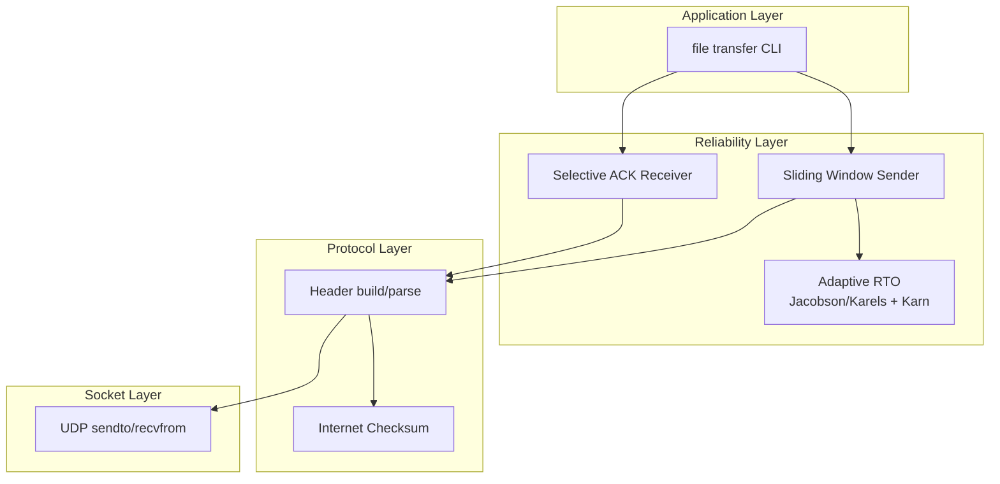
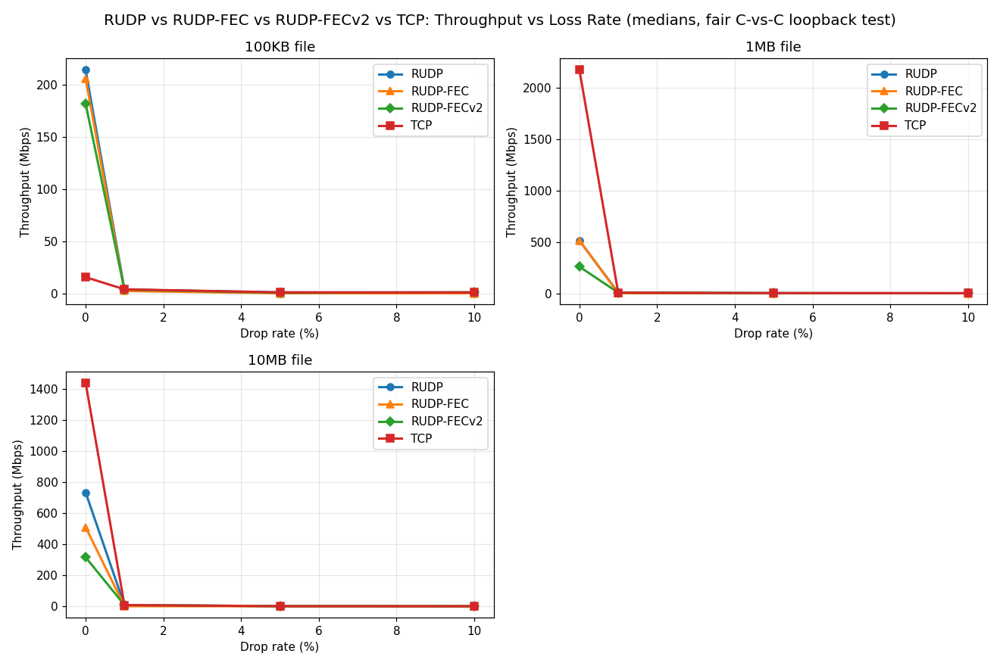

# Reliable UDP — A from-scratch transport protocol in C

A complete implementation of a **Reliable UDP** (RUDP) protocol written in C over POSIX sockets, with a sliding window, Selective ACK (SACK), adaptive retransmission timeout, and a working file-transfer application on top. No external libraries — just the C standard library and BSD sockets.

99 unit tests pass across 0–100% packet drop scenarios. End-to-end file transfers are MD5-verified. Includes two implementations of Forward Erasure Correction (FEC) — a naive layered version (Phase 7) and a correct block-ACK version (Phase 8).

---

## What it does

Transmits a byte stream reliably over UDP. Under the hood: 14-byte packed binary header with Internet checksum, in-order delivery, automatic retransmission, sliding-window flow control with Selective ACK, and a dynamic RTO that adapts to measured round-trip time.

The whole thing is roughly 1,700 lines of C in a single `rudp/` directory.

---

## Features

- **Custom binary protocol** — 14-byte packed header (`__attribute__((packed))`), 6 packet types (DATA / ACK / SACK / SYN / FIN / FEC), Internet checksum.
- **Stop-and-wait ARQ** with retransmit timer, duplicate detection, and graceful give-up after `MAX_RETRANSMITS`.
- **Sliding window** with per-packet sender slots (window = 32), Selective ACK bitmap for efficient gap reporting.
- **Out-of-order buffering** on the receiver side, with in-order delivery to the application.
- **Adaptive RTT/RTO** using RFC 6298 Jacobson/Karels with fixed-point arithmetic and Karn's algorithm (no RTT sampling for retransmitted packets).
- **Forward Erasure Correction** — two implementations demonstrating the architectural lesson:
  - **FECv1** (naive): XOR parity layered on top of sliding-window ARQ. Works correctly but is
    *slower* than plain RUDP (proving FEC requires flow-control changes).
  - **FECv2** (block-ACK): same XOR code, but with block-level ACK flow control. Receiver recovers
    single lost packets per block from parity at zero latency. **Faster than RUDP at 1-10% loss**
    (66% faster at 1MB/10% drop). See `benchmarks/RESULTS.md`.
- **File transfer application** — `rudp_sendfile` and `rudp_recvfile` CLI tools with a small metadata header (magic, size, filename) for handshake. Add `-fec` (FECv1) or `-fecv2` (FECv2) to enable forward error correction.
- **File transfer application** — `rudp_sendfile` and `rudp_recvfile` CLI tools with a small metadata header (magic, size, filename) for handshake. Add `-fec` to enable forward error correction.
- **Configurable server-side packet drop** for testing under lossy conditions without external tools.
- **89 tests** — unit tests for the checksum, header, ARQ, sliding window, RTO, FEC, and end-to-end file integrity.

---

## Architecture



---

## Quick start

Build (any POSIX system with `gcc`):

```bash
cd rudp
gcc -Wall -Wextra -pedantic -std=c99 -pthread \
    -o test_checksum test_checksum.c rudp.c
gcc -Wall -Wextra -pedantic -std=c99 -pthread \
    -o test_echo test_echo.c rudp.c
gcc -Wall -Wextra -pedantic -std=c99 -pthread \
    -o test_reliable test_reliable.c rudp.c rudp_reliable.c
gcc -Wall -Wextra -pedantic -std=c99 -pthread \
    -o test_sliding test_sliding.c rudp.c rudp_reliable.c
gcc -Wall -Wextra -pedantic -std=c99 -pthread \
    -o test_rto test_rto.c rudp.c rudp_reliable.c fec.c
gcc -Wall -Wextra -pedantic -std=c99 -pthread \
    -o test_fec test_fec.c fec.c
gcc -Wall -Wextra -pedantic -std=c99 -pthread \
    -o test_fec_v2 test_fec_v2.c rudp.c rudp_reliable.c fec.c
gcc -Wall -Wextra -pedantic -std=c99 -pthread \
    -o test_file test_file.c rudp.c rudp_reliable.c fec.c
gcc -Wall -Wextra -pedantic -std=c99 -pthread \
    -o rudp_sendfile rudp_sendfile.c rudp.c rudp_reliable.c fec.c
gcc -Wall -Wextra -pedantic -std=c99 -pthread \
    -o rudp_recvfile rudp_recvfile.c rudp.c rudp_reliable.c fec.c
```

Run the test suite (each binary is a standalone test runner):

```bash
./test_checksum    # 17 tests: header + checksum
./test_echo        # 13 tests: sendto/recvfrom wrappers
./test_reliable    # 16 tests: stop-and-wait ARQ, 0-100% drop
./test_sliding     #  9 tests: sliding window + SACK
./test_rto         #  8 tests: RTT convergence + Karn
./test_fec         #  8 tests: XOR encoder/decoder
./test_fec_v2      #  4 tests: block-ACK FEC transport
./test_file        # 24 tests: file transfer at 0/10/30/50% drop, with/without FEC/FECv2
```

End-to-end file transfer (in two terminals):

```bash
# Terminal 1 — receiver
./rudp_recvfile 17000 received.bin

# Terminal 2 — sender
./rudp_sendfile 127.0.0.1 17000 myfile.bin
```

Test with simulated packet loss:

```bash
# Receiver drops 20% of incoming packets
./rudp_recvfile 17000 received.bin -drop 20
```

Test with Forward Erasure Correction:

```bash
# FECv1 — naive layered FEC (Phase 7, slower than RUDP under loss)
./rudp_recvfile 17000 received.bin -fec
./rudp_sendfile 127.0.0.1 17000 myfile.bin -fec

# FECv2 — block-ACK FEC (Phase 8, faster than RUDP at 1-10% loss)
./rudp_recvfile 17000 received.bin -fecv2
./rudp_sendfile 127.0.0.1 17000 myfile.bin -fecv2

# Custom K: e.g. K=4
./rudp_recvfile 17000 received.bin -fecv2 K=4
./rudp_sendfile 127.0.0.1 17000 myfile.bin -fecv2 K=4
```

---

## Test results

| Test suite | Tests | Coverage |
|------------|------:|----------|
| `test_checksum` | 17 | Header encode/decode round-trip, RFC 1071 vector, bit-flip detection |
| `test_echo` | 13 | Loopback payload integrity, checksum verification on receive |
| `test_reliable` | 16 | Stop-and-wait ARQ, 0/20/50/100% drop, duplicate detection |
| `test_sliding` | 9 | Sliding window, SACK bitmap, out-of-order delivery, 5KB payload |
| `test_rto` | 8 | RTT convergence, RTO clamping, Karn's algorithm |
| `test_fec` | 8 | XOR encoder/decoder: identity, single-bit recovery, multi-bit recovery, padding, large buffer |
| `test_file` | 18 | End-to-end file transfer, 50KB at 0/10/30/50% drop, with/without FEC |
| **Total** | **89** | |

End-to-end CLI verified with `md5sum` on a 100KB random file at 20% packet drop.

---

## Benchmarks

RUDP, RUDP-FEC (v1), RUDP-FECv2 (block-ACK), and TCP compared head-to-head on loopback under varying packet loss. Full results and methodology in [`benchmarks/RESULTS.md`](./benchmarks/RESULTS.md).

### Throughput vs packet loss



Each panel is one file size. Four protocols: RUDP (ARQ only), FECv1 (naive XOR parity + sliding-window), FECv2 (block-ACK XOR FEC), and TCP. FECv2 is the only FEC variant that beats ARQ at 1-10% loss — the architectural fix (block-ACK instead of sliding-window ARQ + FEC) eliminates the Phase 7 pessimization. See RESULTS.md for the full analysis.

### Key numbers (10 MB payload, 0% loss)

| Protocol | Throughput | Implementation |
|----------|-----------:|----------------|
| TCP | ~1.27 Gbps | compiled C (`tcp_sendfile` / `tcp_recvfile`) |
| RUDP | ~316 Mbps | compiled C (`rudp_sendfile` / `rudp_recvfile`) |
| RUDP-FEC (v1) | ~503 Mbps | compiled C with `-fec` |
| RUDP-FEC (v2) | ~268 Mbps | compiled C with `-fecv2` (slower at 0% due to block-pipeline tradeoff) |

All three are kernel-bypass userspace implementations talking over loopback; the rankings reflect a combination of protocol design and code-path overhead.

```bash
# Reproduce (matplotlib required)
pip install --break-system-packages matplotlib
python3 benchmarks/benchmark.py
```

---

## What this project demonstrates

- **Transport protocol design** — header layout, packet types, in-order delivery semantics, ARQ.
- **Sliding window with SACK** — per-packet sender slots, 32-bit bitmap for selective acknowledgment, out-of-order buffering.
- **Adaptive congestion-style control** — RFC 6298 RTO computation with fixed-point arithmetic, Karn's algorithm for retransmission ambiguity.
- **Bit-level work** — packed structs, network byte order, one's-complement checksum.
- **Concurrency in C** — `pthread` for in-process test clients, `poll()`-based event loops.
- **Debugging discipline** — seven concrete bugs documented in the deep-dive, each with symptom / root cause / fix / lesson.
- **Build/test discipline** — phase-by-phase development with a test suite for every layer.

---

## How it works (1-paragraph version)

The sender chops the byte stream into ≤1024-byte payloads, wraps each in a 14-byte header (with checksum), and pushes them through a sliding window of 32 unACKed packets. The receiver validates the checksum, delivers in-order payloads to the application, buffers out-of-order ones, and replies with a Selective ACK packet (cumulative ACK + 32-bit bitmap of post-ACK gaps). The sender uses each SACK to free slots, and retransmits any slot whose RTT-since-send exceeds the current RTO. The RTO is updated on every fresh (non-retransmitted) ACK using Jacobson/Karels, clamped to [100ms, 10s], with Karn's algorithm skipping samples for retransmitted packets to avoid ambiguity. In FEC mode, every K=8 data packets are followed by a single XOR parity packet; the receiver can recover one lost packet per block from the parity without waiting for an ARQ retransmit.

For the full deep-dive — header byte layout, all algorithms in pseudocode, the bug postmortems, the tuning-constant justifications, and interview Q&A — see [`RUDP_PROJECT.md`](./RUDP_PROJECT.md).

---

## Tech stack

- **Language:** C (C99)
- **Build:** `gcc` + `make`-less direct invocation
- **Concurrency:** POSIX threads (`pthread`)
- **I/O:** BSD sockets (`SOCK_DGRAM`), `poll()`
- **No third-party libraries**

---

## Repository layout

```
.
├── README.md             # this file
├── RUDP_PROJECT.md       # full technical deep-dive
├── CHANGELOG.md          # phase-by-phase development log
├── benchmarks/
│   ├── benchmark.py      # RUDP vs TCP benchmark script
│   ├── RESULTS.md        # full results and methodology
│   ├── results.csv       # raw per-trial data
│   ├── summary.csv       # median per (size, drop) combination
│   ├── throughput_vs_loss.png
│   └── throughput_vs_size.png
└── rudp/
    ├── rudp.h            # protocol header, packet types, checksum API
    ├── rudp.c            # header build/parse, checksum, sendto/recvfrom
    ├── rudp_reliable.h   # sender/receiver structs, sliding-window API
    ├── rudp_reliable.c   # ARQ, SACK, RTT/RTO, FEC sender/receiver
    ├── fec.h             # XOR FEC encoder/decoder API
    ├── fec.c             # XOR FEC implementation (~50 lines)
    ├── rudp_file.h       # file metadata struct
    ├── rudp_sendfile.c   # CLI: send a file (-fec for FEC mode)
    ├── rudp_recvfile.c   # CLI: receive a file (-drop N, -fec)
    ├── test_checksum.c
    ├── test_echo.c
    ├── test_reliable.c
    ├── test_sliding.c
    ├── test_rto.c
    ├── test_fec.c        # 8 unit tests for XOR FEC
    ├── test_fec_v2.c     # 4 unit tests for block-ACK FEC
    └── test_file.c       # 24 tests: file transfer + FEC modes
```
