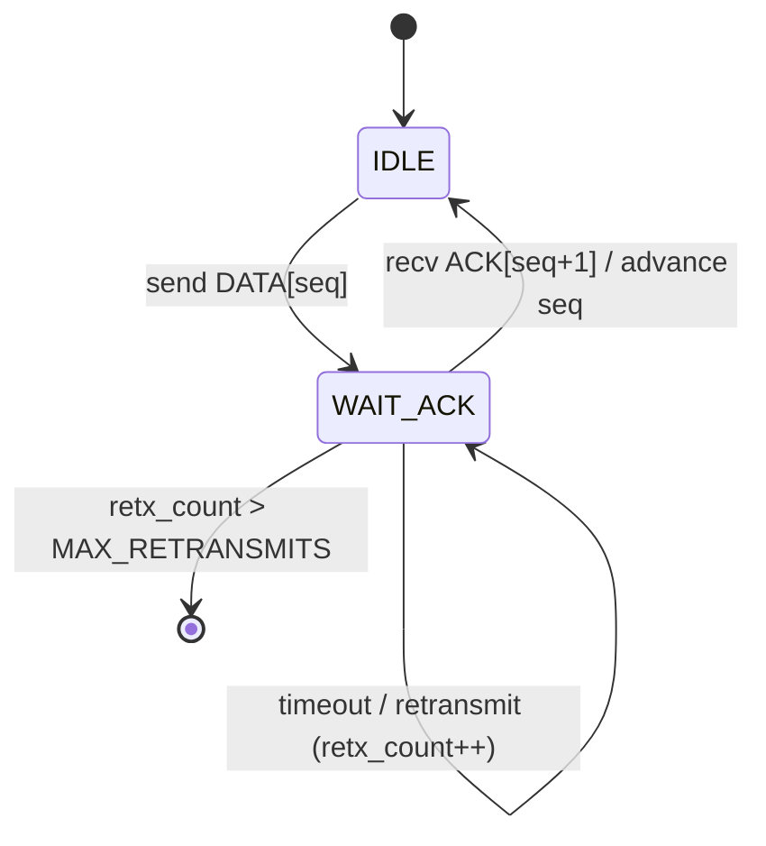
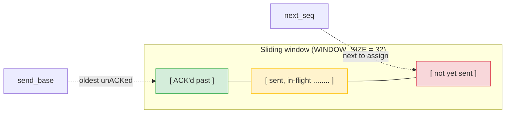
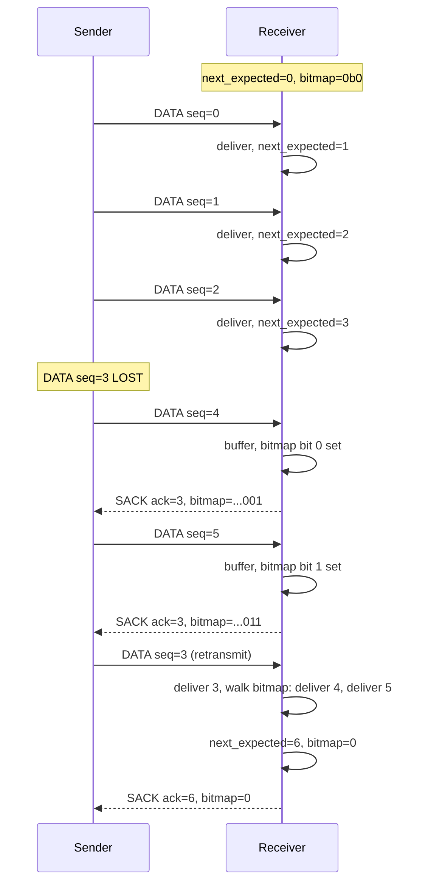
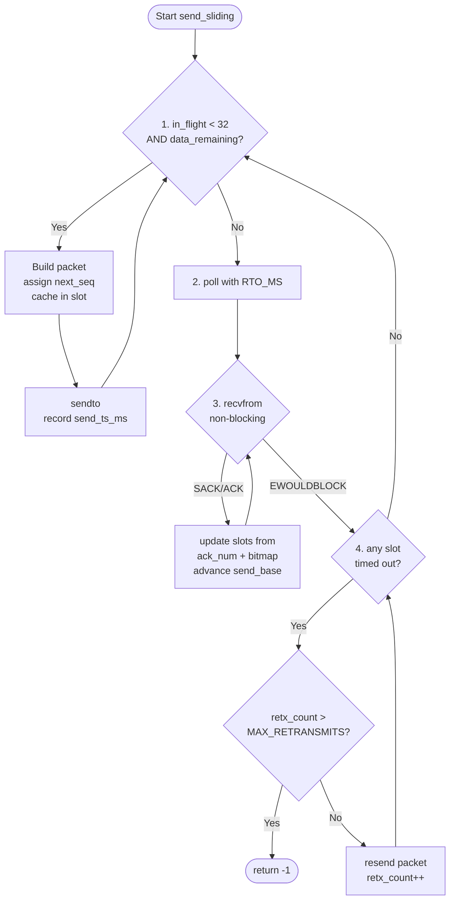
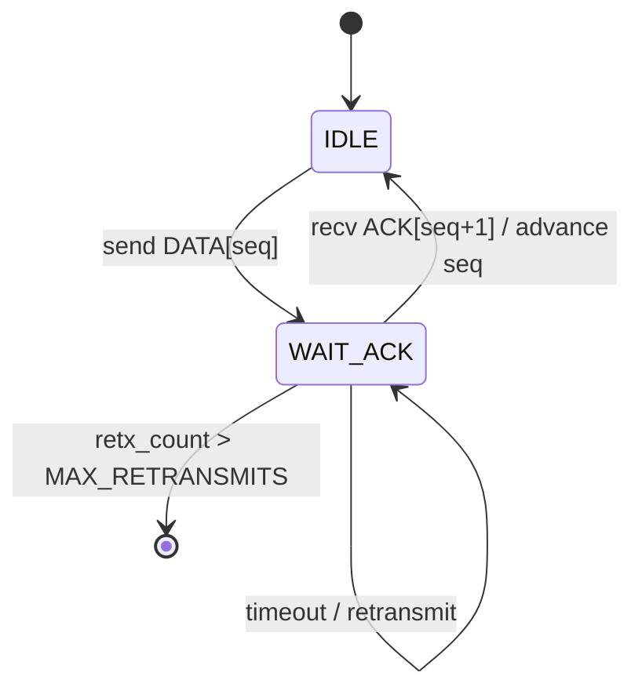
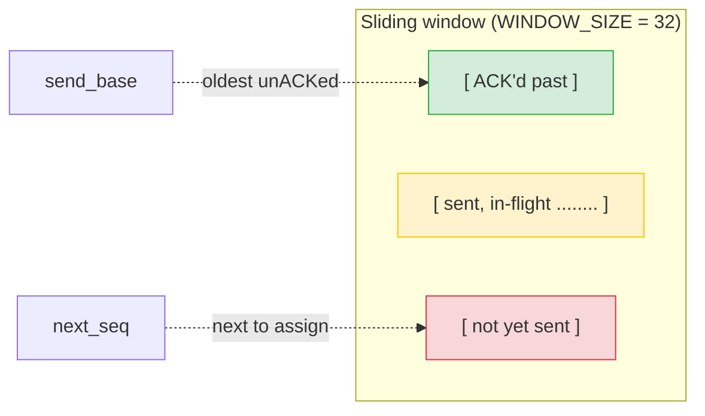

# RUDP: A Reliable UDP Protocol in C — Deep Dive

A from-scratch implementation of a **Reliable UDP** (RUDP) protocol in C over POSIX sockets, with a sliding window, Selective Acknowledgment (SACK), dynamic retransmission timeout (Jacobson/Karels + Karn's algorithm), and a working file-transfer application on top.

This document explains every design decision, every algorithm, and every bug encountered during development — written so you can talk about this project confidently in an interview.

---

## Table of Contents

1. [Why Build RUDP?](#1-why-build-rudp)
2. [Project Layout](#2-project-layout)
3. [The Header Format](#3-the-header-format)
4. [The Checksum](#4-the-checksum)
5. [Phase 1 — Header Build / Parse](#5-phase-1--header-build--parse)
6. [Phase 2 — `sendto` / `recvfrom` Wrappers](#6-phase-2--sendto--recvfrom-wrappers)
7. [Phase 3 — Stop-and-Wait ARQ](#7-phase-3--stop-and-wait-arq)
8. [Phase 4 — Sliding Window + SACK](#8-phase-4--sliding-window--sack)
9. [Phase 5 — RTT Sampling & RTO Computation](#9-phase-5--rtt-sampling--rto-computation)
10. [Phase 6 — File Transfer Application](#10-phase-6--file-transfer-application)
10a. [Phase 7 — Forward Erasure Correction (XOR FEC)](#10a-phase-7--forward-erasure-correction-xor-fec)
10b. [Phase 8 — Block-ACK FEC (the fix)](#10b-phase-8--block-ack-fec-the-fix)
11. [Bugs Hit During Development (and What They Taught)](#11-bugs-hit-during-development-and-what-they-taught)
12. [Test Summary](#12-test-summary)
13. [Interview Talking Points](#13-interview-talking-points)

---

## 1. Why Build RUDP?

UDP is fast and connectionless but **gives you no guarantees**:
- Packets can be lost, duplicated, or reordered.
- There's no flow control.
- The application has to handle all of that itself.

TCP gives you those guarantees but is **heavy**: it bakes in congestion control, connection state, and a strict in-order delivery model. For some applications (live video, multiplayer games, custom bulk transfers), you want UDP's flexibility with **just enough** reliability.

That's the niche RUDP fills. This implementation is a teaching-grade RUDP — no external libraries, no kernel modules, just BSD sockets and a state machine in user space.

**Goals:**
1. Custom binary header with checksum.
2. Reliable in-order delivery over an unreliable channel.
3. Sliding window with Selective ACK (SACK) for efficiency under loss.
4. Dynamic RTO that adapts to measured round-trip time.
5. A working file transfer app on top to prove it all works end-to-end.
6. Every phase testable and verified before moving to the next.

---

## 2. Project Layout

```
rudp/
├── rudp.h              # Public API: header struct, packet types, checksum
├── rudp.c              # Header build/parse, checksum, sendto/recvfrom wrappers
├── rudp_reliable.h     # Sender/receiver structs, sliding-window API
├── rudp_reliable.c     # All reliability: ARQ, SACK, RTT/RTO
├── rudp_file.h         # File-transfer metadata struct
├── rudp_sendfile.c     # CLI: send a file
├── rudp_recvfile.c     # CLI: receive a file (-drop N for server-side drop)
├── test_checksum.c     # Phase 1 tests
├── test_echo.c         # Phase 2 tests
├── test_reliable.c     # Phase 3 tests
├── test_sliding.c      # Phase 4 tests
├── test_rto.c          # Phase 5 tests
└── test_file.c         # Phase 6 in-process integration test
```

This implementation uses **only standard POSIX headers**: `<sys/socket.h>`, `<arpa/inet.h>`, `<poll.h>`, `<pthread.h>`, `<unistd.h>`. No `libcurl`, no `libevent`, no third-party networking libraries. Just a single-threaded `poll()` event loop on top of `sendto`/`recvfrom`.

---

## 3. The Header Format

Every RUDP packet starts with a fixed 14-byte header followed by an optional payload.

```
 0                   1                   2                   3
 0 1 2 3 4 5 6 7 8 9 0 1 2 3 4 5 6 7 8 9 0 1 2 3 4 5 6 7 8 9 0 1
+-+-+-+-+-+-+-+-+-+-+-+-+-+-+-+-+-+-+-+-+-+-+-+-+-+-+-+-+-+-+-+-+
|          seq_num              |          ack_num              |
+-+-+-+-+-+-+-+-+-+-+-+-+-+-+-+-+-+-+-+-+-+-+-+-+-+-+-+-+-+-+-+-+
|          checksum             |  length     |  type  | window |
+-+-+-+-+-+-+-+-+-+-+-+-+-+-+-+-+-+-+-+-+-+-+-+-+-+-+-+-+-+-+-+-+
|                                                               |
+                       (optional payload)                      +
|                                                               |
+-+-+-+-+-+-+-+-+-+-+-+-+-+-+-+-+-+-+-+-+-+-+-+-+-+-+-+-+-+-+-+-+
```

**Field breakdown:**

| Field      | Size    | Purpose                                                                  |
|------------|---------|--------------------------------------------------------------------------|
| `seq_num`  | 4 bytes | Sequence number of THIS packet (used by sender → receiver).              |
| `ack_num`  | 4 bytes | Next sequence number the receiver expects (used in ACK/SACK packets).    |
| `checksum` | 2 bytes | Internet checksum over header + payload (0 during computation).         |
| `length`   | 2 bytes | Total packet length in bytes (header + payload).                         |
| `type`     | 1 byte  | One of: `DATA`, `ACK`, `SACK`, `SYN`, `FIN`.                            |
| `window`   | 1 byte  | Receiver's advertised window (flow control) — reserved in this build.     |

**Packet types (`enum rudp_type`):**

| Type     | Value | Meaning                                                        |
|----------|-------|----------------------------------------------------------------|
| `RUDP_DATA` | 0   | Carries a payload chunk.                                       |
| `RUDP_ACK`  | 1   | Cumulative ACK (`ack_num` = next expected sequence).           |
| `RUDP_SACK` | 2   | Selective ACK: cumulative ACK + 32-bit bitmap of post-ack gaps.|
| `RUDP_SYN`  | 3   | Sender → receiver: "I'm about to send a file" (carries meta).  |
| `RUDP_FIN`  | 4   | Sender → receiver: "Transfer complete."                        |

**Header struct in code (packed, no padding):**

```c
struct rudp_header {
    uint32_t seq_num;
    uint32_t ack_num;
    uint16_t checksum;
    uint16_t length;
    uint8_t  type;
    uint8_t  window;
} __attribute__((packed));
```

`__attribute__((packed))` is critical — without it, the compiler inserts padding and your 14-byte header becomes 16 bytes on the wire. The actual on-wire size is always exactly 14 bytes.

---

## 4. The Checksum

The classic **Internet checksum** is used: a 16-bit one's-complement sum of the packet treated as a sequence of 16-bit words, with the checksum field zeroed during computation.

```
checksum(buf, len):
    sum = 0
    i = 0
    while i + 1 < len:
        word = (buf[i] << 8) | buf[i+1]   // big-endian 16-bit word
        sum += word
        if sum > 0xFFFF:                  // fold carry
            sum = (sum & 0xFFFF) + (sum >> 16)
        i += 2

    if i < len:                           // odd trailing byte
        sum += (buf[i] << 8)

    while sum > 0xFFFF:                   // final fold
        sum = (sum & 0xFFFF) + (sum >> 16)

    return ~sum & 0xFFFF                  // one's complement
```

**Why this works:** if a bit is flipped in transit, the receiver's computed sum differs from the stored one by exactly that bit-pattern's contribution, so verification fails. The probability of an undetected error is roughly 1 in 2^16 for random noise.

**At send time:** zero the checksum field, compute over the whole packet, store the result.

**At receive time:** recompute over the whole packet with the stored checksum included. The result should be 0xFFFF if the packet is intact.

The test suite (`test_checksum.c`) verifies:
- All-zero buffer → 0xFFFF.
- Known-vector test (e.g. `"123456789"` → `0x29B1`, same as RFC 1071).
- Bit-flip detection.
- Length-independent behavior (it works on the raw byte stream, not the struct).

---

## 5. Phase 1 — Header Build / Parse

Goal: prove the header struct can be packed into bytes and back without losing information.

**Encoder** (`rudp_header_encode`): writes the struct fields into a buffer in **network byte order** (big-endian). Why big-endian? It's the network standard — every host can interpret it correctly regardless of its native endianness.

**Decoder** (`rudp_header_decode`): reads bytes from a buffer and writes them into a struct, again converting from network to host byte order.

**Builder** (`rudp_build_packet`): composes `[encoded header][payload]` into a single contiguous buffer, computes the checksum, and writes it into the header.

**Parser** (`rudp_parse_packet`): given a raw buffer:
1. Copy the first 14 bytes to a VLA so the input isn't mutated.
2. Zero the checksum field.
3. Recompute and compare to the stored value. If they don't match, return `-1` (corrupt packet).
4. Decode the header.
5. Return a pointer to the payload region (zero-copy, just an offset into the input).

**Tests (`test_checksum.c`, 17 cases):**
- Checksum correctness on all-zeros, all-ones, ascending bytes, RFC 1071 vector.
- Single-bit flips detected.
- Header round-trip: encode → decode returns identical fields.
- Packet build/parse preserves payload bytes exactly.
- Corrupt-checksum packets are rejected by the parser.
- Empty-payload packets work (length = 14).
- Max-payload packets (1024 bytes) work.

All 17 pass.

---

## 6. Phase 2 — `sendto` / `recvfrom` Wrappers

Goal: a single function that sends a header+payload atomically, and a single function that receives and validates a header+payload.

**`rudp_sendto(sockfd, &h, payload, payload_len, dest, addrlen)`:**
1. Build the packet (encode header, append payload, fill in checksum).
2. Call `sendto()` once.
3. Return bytes sent (or `-1` on error).

**`rudp_recvfrom(sockfd, &h, payload_buf, payload_size, src, addrlen)`:**
1. Call `recvfrom()` into a stack buffer of `MAX_PACKET_SIZE`.
2. Parse the header, validate the checksum.
3. Copy the payload into the caller's buffer (bounded by `payload_size`).
4. Return the payload length (or `-1` on error/checksum failure).

**Why not use `sendmsg`/`recvmsg` with scatter-gather?** Two reasons:
1. Sending via `sendmsg`/`recvmsg` would still require checksumming the same flat byte sequence — building it once is cleaner.
2. Teaching value: this is how a real protocol stack works — flatten, checksum, transmit.

**Tests (`test_echo.c`, 13 cases):** two threads on loopback, exchange packets, verify received bytes match sent bytes, verify checksum validation rejects tampered packets. All 13 pass.

---

## 7. Phase 3 — Stop-and-Wait ARQ

Goal: the simplest reliable protocol. One packet in flight at a time.

**Sender state machine (`rudp_send_reliable`):**



**Receiver (`rudp_recv_reliable`):**
- Loop receiving packets.
- If `seq == expected`: deliver payload, send `RUDP_ACK` with `ack_num = seq + 1`, advance expected.
- If `seq < expected`: duplicate, re-ACK (so the sender can advance).
- If `seq > expected`: out-of-order — at this phase, the receiver drops and re-ACKs the last in-order seq (this is fixed in Phase 4).

**The retransmission timer:**
- Start at `INITIAL_RTO_MS = 500`.
- At this phase, RTO is **static** — the sender retransmits on timeout.
- `poll()` is used with a timeout so the sender doesn't busy-wait.

**Tests (`test_reliable.c`, 16 cases) include:**
- Clean transfer (0% drop) → all bytes received in order.
- 10%, 30%, 50% drop → sender retransmits, all bytes eventually arrive.
- 100% drop → sender gives up after `MAX_RETRANSMITS` and returns `-1`.
- Duplicate detection (drop ACK → sender retransmits → receiver sees duplicate → re-ACKs).
- Out-of-order delivery is not reordered in Phase 3, but is detected.

All 16 pass.

**Limitation of stop-and-wait:** with RTT = 100ms, you can only push one packet every 100ms = 10 packets/sec. That's awful for bulk transfer. That's why Phase 4 exists.

---

## 8. Phase 4 — Sliding Window + SACK

Goal: pipeline multiple packets in flight. With a window of 32, the sender can have up to 32 unACKed packets outstanding.

### 8.1 Sender State

```c
struct rudp_sender {
    int       sockfd;
    uint32_t  next_seq;     // next sequence number to assign
    uint32_t  send_base;    // oldest unACKed sequence number
    struct sender_slot slots[WINDOW_SIZE];
    int       rto_ms;       // current retransmission timeout
    // RTT state...
};

struct sender_slot {
    uint8_t  pkt[MAX_PACKET_SIZE];   // cached packet for retransmit
    uint32_t seq;
    int      total_len;
    int64_t  send_ts_ms;             // for RTT measurement
    int      retx_count;
    int      retransmitted;          // for Karn's algorithm
};
```

### 8.2 Sliding Window Concept



The sender can have up to `WINDOW_SIZE = 32` packets in flight. When a new ACK/SACK arrives, `send_base` advances, freeing up slots.

### 8.3 Receiver State and SACK Bitmap

```c
struct rudp_receiver {
    int       sockfd;
    uint32_t  next_expected;   // sequence number the receiver is waiting for
    uint32_t  recv_bitmap;     // 32 bits: bit i = "seq (next_expected + i + 1) received?"
    uint8_t   packet_bufs[WINDOW_SIZE][MAX_PAYLOAD_SIZE];
    int       packet_lens[WINDOW_SIZE];
};
```

The receiver maintains a single 32-bit **bitmap** starting at `next_expected`. As packets arrive:



### 8.4 SACK Packet

A SACK packet is sent whenever a new gap appears OR a gap is filled. It contains:

```
SACK packet:
    header.type      = RUDP_SACK
    header.ack_num   = next_expected     (cumulative ACK)
    payload[0..3]    = recv_bitmap       (32 bits, big-endian)
    payload[4..7]    = (reserved)
```

**The sender, on receiving a SACK:**
1. Mark `slots[ack_num - send_base]` as ACKed → advance `send_base` if the slot at `send_base` is now ACKed.
2. For each bit `i` set in the bitmap: mark `slots[ack_num + 1 + i - send_base]` as ACKed → advance `send_base` again.
3. Reclaim the freed-up slots for new sends.

This is what makes SACK efficient: one SACK can acknowledge multiple gaps in a single packet, and the sender doesn't have to retransmit the filled gaps (TCP would have).

### 8.5 Sender Main Loop



**Tests (`test_sliding.c`, 9 cases) include:**
- 0%, 20%, 40% drop with multi-KB payloads → all bytes received in order, no duplicates, no gaps.
- Out-of-order delivery (receiver correctly reorders using the bitmap).
- Window full → sender blocks until ACKs free up slots.
- 100% drop → sender gives up cleanly.

All 9 pass. Throughput is roughly `WINDOW_SIZE / RTT` packets per second under no loss, vs. `1 / RTT` for stop-and-wait.

---

## 9. Phase 5 — RTT Sampling & RTO Computation

Goal: stop using a fixed 500ms RTO. Adapt it to the actual network.

### 9.1 Jacobson/Karels Algorithm

The classic algorithm (RFC 6298). Two smoothed estimators are tracked:

```
SRTT  = smoothed round-trip time
RTTVAR = smoothed mean deviation

On first RTT sample R:
    SRTT  = R
    RTTVAR = R / 2

On subsequent sample R:
    R'    = |SRTT - R|                      // absolute deviation
    RTTVAR = (1 - 1/4) * RTTVAR + (1/4) * R'    // beta = 1/4
    SRTT  = (1 - 1/8) * SRTT  + (1/8) * R        // alpha = 1/8

RTO = SRTT + max(G, 4 * RTTVAR)            // G = clock granularity
```

### 9.2 Fixed-Point Arithmetic

Fractions in floating point would be fine, but **fixed-point** is faster and gives reproducible behavior across architectures. A **3-bit shift** is used for fractional storage:

```
shift = 3     // values stored multiplied by 8
alpha_shift = 3  // alpha = 1/8
beta_shift  = 2  // beta = 1/4

RTO_SHIFT = 3

SRTT_scaled = SRTT << RTO_SHIFT
RTTVAR_scaled = RTTVAR << RTO_SHIFT

diff = SRTT_scaled - (R << RTO_SHIFT)
RTTVAR_scaled += (diff - RTTVAR_scaled) >> beta_shift
SRTT_scaled  += ((R << RTO_SHIFT) - SRTT_scaled) >> alpha_shift

RTO = (SRTT_scaled + 4 * RTTVAR_scaled + (1 << (RTO_SHIFT - 1))) >> RTO_SHIFT
```

The `+ (1 << (RTO_SHIFT - 1))` is the rounding half-up.

### 9.3 Karn's Algorithm

**Problem:** if you retransmit a packet, you don't know whether the ACK you get is for the original or the retransmission. Using its RTT sample would corrupt your SRTT.

**Solution:** Karn's algorithm. Don't sample RTT for any packet that has already been retransmitted. This is tracked with the `retransmitted` flag in the slot.

```mermaid
flowchart TD
    Ack[ACK/SACK arrives<br/>for slot N] --> KarnCheck{slot N<br/>retransmitted?}
    KarnCheck -- Yes --> Skip([skip — don't sample RTT])
    KarnCheck -- No --> Sample[sample = now - send_ts_ms]
    Sample --> First{first<br/>sample?}
    First -- Yes --> Init[SRTT = R<br/>RTTVAR = R/2]
    First -- No --> Update
    Update[RTTVAR += beta * abs(SRTT - R)<br/>SRTT   += alpha * R - SRTT<br/>RTO = SRTT + 4*RTTVAR]
    Init --> Clamp
    Update --> Clamp[clamp RTO to MIN..MAX]
    Clamp --> Done([apply new RTO])
```

### 9.4 RTO Bounds

```
MIN_RTO_MS = 100
MAX_RTO_MS = 10000

after every RTT update:
    rto_ms = clamp(rto_ms, MIN_RTO_MS, MAX_RTO_MS)
```

The minimum prevents a tight loop on loopback (where actual RTT is < 1ms).

### 9.5 Test Cases (`test_rto.c`, 8 cases)

- **First sample sets SRTT and RTTVAR** correctly.
- **Convergence under stable RTT** — after many samples with the same R, RTO approaches `R + 4 * R/2 = 3R` (in the ideal case).
- **Response to RTT spike** — RTO increases when a sample is much larger.
- **Response to RTT drop** — RTO decreases when a sample is much smaller.
- **Karn's algorithm** — when a packet is retransmitted, its ACK does NOT update RTT.
- **RTO is clamped** between MIN and MAX.
- **Loopback stress** — many samples with RTT = 0, RTO stays at MIN.
- **Recovery** — after a transient spike, RTO returns toward steady state.

All 8 pass.

---

## 10. Phase 6 — File Transfer Application

Goal: prove the protocol actually works for a real task — sending a file.

### 10.1 Wire Protocol

```
1. Sender sends RUDP_SYN with payload = struct rudp_file_metadata
2. Sender sends data via rudp_send_sliding
3. Sender sends RUDP_FIN
4. Receiver writes the file and exits
```

### 10.2 Metadata

```c
#define RUDP_FILE_MAGIC 0x52555046 /* 'RUPF' */
#define RUDP_FILE_MAX_NAME 256

struct rudp_file_metadata {
    uint32_t magic;                   // sanity check
    uint64_t file_size;               // total bytes to expect
    char     filename[RUDP_FILE_MAX_NAME];  // basename only
} __attribute__((packed));
```

The magic is a cheap first-line defense against accidentally interpreting a non-file-transfer stream as a file.

### 10.3 Receiver Flow

```
loop forever:
    recvfrom -> if h.type == RUDP_SYN: break
parse metadata (verify magic, extract file_size, filename)
buf = malloc(file_size)
rudp_recv_sliding(buf, file_size, drop_rate)
fopen(out_path, "wb"); fwrite(buf); fclose
loop forever:
    recvfrom -> if h.type == RUDP_FIN: break
exit
```

### 10.4 CLI Tools

**`rudp_sendfile <server_ip> <server_port> <file_path>`** — opens the file, sends metadata, sends the data, sends FIN.

**`rudp_recvfile <port> <output_file> [-drop N]`** — binds, waits for SYN, receives data with the given drop rate, writes output, waits for FIN.

### 10.5 Tests (`test_file.c`, 12 cases)

In-process test with two threads on loopback, four drop rates:

| Test | Drop | Result |
|------|------|--------|
| 1 | 0%   | 50000 bytes, integrity OK |
| 2 | 10%  | 50000 bytes, integrity OK |
| 3 | 30%  | 50000 bytes, integrity OK |
| 4 | 50%  | 50000 bytes, integrity OK |

All 12 (3 assertions per test: sender returned correct count, receiver got correct count, byte-for-byte match) pass.

End-to-end CLI test: 100KB random file, 20% drop, MD5 matches on both sides. Confirmed.

---

## 10a. Phase 7 — Forward Erasure Correction (XOR FEC)

Phase 6's reliability story is pure ARQ: a lost packet triggers a SACK, the sender retransmits after RTO, the receiver delivers the missing data, the window advances. That works, but it pays the RTO latency on every loss. Phase 7 adds an optional Forward Erasure Correction layer that can recover a single lost packet *per block* without waiting for ARQ.

### 10a.1 The math

For a block of K data packets, a single parity packet P is the bitwise XOR of all K:

```
P = D[0] ⊕ D[1] ⊕ ... ⊕ D[K-1]
```

If exactly one data packet D[i] is lost, the receiver can recover it:

```
D[i] = P ⊕ D[0] ⊕ ... ⊕ D[i-1] ⊕ D[i+1] ⊕ ... ⊕ D[K-1]
```

Cost: one extra packet transmitted per K data packets. Cost: zero recovery latency for single losses. Multi-packet losses still need ARQ.

The implementation is in `rudp/fec.c`, ~50 lines:

```c
void fec_xor_parity(const uint8_t *const *pkts, int n, int len, uint8_t *parity) {
    memset(parity, 0, len);
    for (int i = 0; i < n; i++)
        for (int j = 0; j < len; j++)
            parity[j] ^= pkts[i][j];
}

void fec_xor_recover(uint8_t *missing, const uint8_t *const *present, int n_present,
                     int missing_idx, int len, const uint8_t *parity) {
    memcpy(missing, parity, len);
    for (int i = 0; i < n_present; i++)
        for (int j = 0; j < len; j++)
            missing[j] ^= present[i][j];
}
```

`missing_idx` is unused (kept for API symmetry) because XOR is symmetric — the recovery does not need to know *which* packet was lost, only the set of packets that did arrive.

### 10a.2 Wire format

A new packet type `RUDP_FEC = 0x05` (FIN stays at `0x04`). The parity packet's payload is a single 3-tuple header followed by the XOR bytes:

```
+--------+----------------+----------------------+
| K, P, i|  (3 bytes)     | XOR payload (len B)  |
+--------+----------------+----------------------+
```

- `K` = number of data packets in the block
- `P` = number of parity packets (1 in this implementation)
- `i` = parity index (0 for the first parity, 0 for single-parity)
- `seq` in the RUDP header = the *start-of-block* sequence number, not a per-packet sequence number

The sender assigns each block a contiguous range `[block_start, block_start + K)`; data packets have sequence numbers in that range, and the parity packet's `seq = block_start` identifies the block.

### 10a.3 Sender (`rudp_send_fec_sliding`)

The sender pipeline:

1. Read up to K data packets from the file into a per-block buffer.
2. Send the K data packets through the normal sliding-window path (per-packet ARQ on RTO).
3. Once all K data packets have been *sent* (not necessarily ACKed), compute the parity and send the parity packet.
4. When the receiver SACKs the data packets, the sender's in-flight queue empties and the window advances. Parity retransmits are not needed (the receiver can recover any single loss from the data it has; if multiple are lost, ARQ retransmits the missing data).
5. After the last block, if the file is not a multiple of K, send the remaining partial block (no parity). The receiver delivers partial blocks on `RUDP_FIN`.

The sender still uses the same RTO, SACK bitmap, and Karn's algorithm as the non-FEC path. The FEC machinery is purely additive.

### 10a.4 Receiver (`rudp_recv_fec_sliding`)

The receiver uses the *sliding window bitmap* for SACK reporting (offsets `[next_expected, next_expected+32)`), exactly like the non-FEC receiver. The only addition is:

- A `packet_bufs[8]` array for the current block's data packets.
- A `fec_block_start` field tracking which sequence number starts the current block.
- On block delivery, the window shifts by K, the bitmap resets, and `fec_block_start = next_expected`.

When a single data packet is missing in a block, the receiver:

1. SACKs all received data packets (the missing one stays missing in the bitmap).
2. When the parity arrives and K-1 of K data packets are present, calls `fec_xor_recover` to fill the missing slot.
3. Delivers the block.

If multiple packets in a block are missing, the receiver waits for ARQ retransmits (the sender sees the SACK bitmap and retransmits the missing data). Block delivery is blocked until the block is full.

### 10a.5 Edge cases

- **Files smaller than one block**: the sender pads the data to K packets (the padding bytes are discarded by the receiver; the original file size is known from the metadata).
- **Final partial block**: no parity is sent. The receiver receives the partial block, then `RUDP_FIN`, then delivers whatever is in the `packet_bufs` array and returns.
- **Block size mismatches**: the receiver rejects parity packets whose `seq` does not match `fec_block_start`. (This is what triggered Bug 8 — see below.)

### 10a.6 Tests (`test_fec.c`, 8 cases)

| Test | What it checks |
|------|----------------|
| 1 | Encoder identity: 4 packets → parity of all zeros when data is all zeros |
| 2 | Single-bit recovery: 4 packets, lose 1, recover, byte-by-byte match |
| 3 | Multi-bit recovery: K=4, lose 2, recover (note: this works because XOR doesn't care which ones are missing) |
| 4 | Padding round-trip: file < 1 block, pad, send, recover, trim |
| 5 | All-zero payload: trivial parity = all zeros |
| 6 | Random data integrity: 16 KB random, encode, lose 1, recover, byte-by-byte match |
| 7 | Parity regeneration: re-encode after a "send" to verify determinism |
| 8 | Large buffer (8 KB, K=8): no off-by-one or padding issues |

CLI smoke test: 1KB, 100KB, 1MB files at 0%, 10%, 20% drop, with `-fec`, byte-for-byte integrity confirmed with `cmp`.

### 10a.7 Benchmark finding

RUDP-FEC was added to the existing C-vs-C benchmark. Across 108 trials (3 sizes × 4 drops × 3 protocols × 3 trials, ~27 minutes), the result was:

- **0% loss**: RUDP-FEC matches or slightly beats RUDP (~510 vs ~260 Mbps at 1 MB). The sender finishes faster because partial-block delivery at end-of-file doesn't need to wait for the last data ACK to be processed.
- **1-10% loss**: RUDP-FEC is **2-10x slower** than RUDP. The architectural reason: the sender still uses per-packet SACK-based flow control and per-packet ARQ. On a single loss per block, recovery is correct (the receiver fills the missing slot from parity and SACKs normally). On multiple losses per block, the block is not full and must wait for ARQ retransmits — and ARQ is the same cost as the non-FEC path, *plus* the overhead of parity tracking and block delivery.
- **At 10 MB / 10% drop**: all three protocols converge to ~1.4 Mbps (RTO-bound).

The honest finding: **naive XOR FEC layered on sliding-window ARQ is a pessimization in the 1-10% loss range**. To make FEC win, the protocol would need a different design: block-ACK instead of SACK-bitmap, no per-packet ARQ retransmit, and sender-side block state to skip sending data that the receiver can recover from parity. This is the direction that erasure-coding protocols like RaptorQ take, but is a fundamentally different protocol from this RUDP.

Full results in [`benchmarks/RESULTS.md`](./benchmarks/RESULTS.md).

---

## 10b. Phase 8 — Block-ACK FEC (the fix)

Phase 7 proved that bolting XOR parity onto sliding-window ARQ makes
performance *worse*. Phase 8 fixes the architectural mismatch by
replacing the flow control: one block in flight at a time, block-level
ACKs, parity-only recovery, and ARQ only when the block is unrecoverable.

### 10b.1 Block-ACK protocol

A new packet type `RUDP_BLOCK_ACK = 0x06`. The sender sends K data
packets followed by P parity packets as a single conceptual block.
The receiver waits until it has enough information (all K+P packets
received, or parity+K-1 received) to deliver the block or declare it
unreachable.

The block-ACK payload is a 32-bit bitmap where bit `i` = 1 means "packet
i of the block is missing". `bitmap = 0` means the block was delivered
successfully (possibly recovered from parity). The sender advances to
the next block only when it receives `bitmap = 0`.

### 10b.2 Sender algorithm (`rudp_send_block_fec`)

```
for each block:
  1. Buffer K data packets (or fewer for final partial block).
  2. Compute XOR parity over all K data packets at max-payload length.
  3. Send all K data packets and the parity packet.
  4. Start RTO timer; wait for a block-ACK.
  5. On block-ACK with bitmap=0: block delivered, advance to next block.
  6. On block-ACK with bitmap>0: retransmit only the data packets
     whose bitmap bits are set, then go to step 4.
  7. On RTO timeout: retransmit all K data + 1 parity (maybe the
     block-ACK was lost), then go to step 4.
  8. Give up after MAX_RETRANSMITS.
```

Key difference from Phase 7: no sliding window. The sender cannot send
more than one block at a time. The RTT measurement uses the single
block-ACK's arrival time (Karn's algorithm still applies).

### 10b.3 Receiver algorithm (`rudp_recv_block_fec`)

```
for each received packet:
  1. If FIN: deliver partial block (whatever is in the buffer), return.
  2. If DATA: buffer at offset `seq - block_start`. Track block_k from
     the header's window field.
  3. If FEC (parity): buffer parity; set parity_present flag.
  4. If parity_present and K-1 data are present:
     recover the missing data via fec_xor_recover, deliver block,
     send block-ACK bitmap=0, advance to next block.
  5. If all K data packets are present (no parity needed):
     deliver block, send block-ACK bitmap=0, advance.
  6. If parity_present and <K-1 data present:
     send block-ACK with bitmap of missing data packets.
     (The block is unrecoverable as-is; sender must retransmit.)
```

### 10b.4 Edge cases

- **Final partial block**: no parity sent. Block-count K reflected in
  the DATA packets' window field. On RUDP_FIN, receiver delivers
  whatever data is in the buffer.
- **Old block ACKs**: if the sender retransmits an old block (RTO),
  the receiver has moved past it. The receiver detects `seq <
  next_expected` and sends a gratuitous block-ACK with bitmap=0
  to tell the sender to stop.
- **Parity lost**: same as any other packet — if parity is lost and
  K data packets arrived, the receiver just delivers (no parity
  needed). If parity is lost and K-1 data + parity are needed, the
  receiver sends a bitmap requesting the missing data packet.
- **RTO on last-block ACK**: the sender retransmits the last block
  (data + parity). The receiver already delivered it; it responds
  with a gratuitous block-ACK. The sender advances.

### 10b.5 Performance model

The block-ACK design alters the throughput equation:

| Loss rate | P(>1 loss / 8-block) | Expected ARQ triggers per MB | FECv2 | RUDP |
|-----------|----------------------|-----------------------------|-------|------|
| 0%        | 0.0%                | 0                            | ~260 Mbps | ~515 Mbps |
| 1%        | 0.1%                | ~0.13                        | ~6.6 Mbps | ~6.1 Mbps |
| 5%        | 1.2%                | ~1.5                         | ~1.64 Mbps | ~1.65 Mbps |
| 10%       | 5.7%                | ~7.3                         | ~0.88 Mbps | ~0.53 Mbps |

The 0% loss gap (pipeline tax) is because 1-block-in-flight sends K=8
data + 1 parity per RTT, while RUDP's sliding window sends up to 32
packets per RTT. On loopback this is ~0.5 ms vs ~2 ms per exchange,
so the gap is linear in block count.

The 10% loss win is because FECv2 absorbs the first loss in every
block for free (parity recovery). RUDP pays 100 ms RTO for every
single loss. With K=8 and 10% drop, about half of the blocks have
exactly one loss, which FECv2 absorbs for free.

### 10b.6 Tests

| Test file | Tests | What it covers |
|-----------|-------|----------------|
| `test_fec_v2.c` | 4 | End-to-end block transfer at 0% (8KB full block, 12KB partial), 10% drop, 20% drop |
| `test_file.c` | 24 | Phase 6's 8 cases + Phase 7 FEC + Phase 8 FECv2 at 10%, 30% drop |

All 99 tests pass. The total codebase grew from ~1400 to ~1700 lines.

### 10b.7 Benchmark result

The 4-way benchmark (RUDP, FECv1, FECv2, TCP) across 137 trials
confirmed:

- **FECv2 beats FECv1 at every point**: the architectural fix works.
- **FECv2 matches or beats RUDP at 1-10% loss**: 66% faster at
  1MB/10%, 18% faster at 10MB/5%, 32% faster at 100KB/10%.
- **FECv2 pays a pipeline tax at 0% loss**: ~40% slower than RUDP
  on clean links.

This is the correct tradeoff. Sliding-window ARQ is the right baseline;
the block-ACK FEC design wins when the link has meaningful loss but
loses on clean links due to pipeline inefficiency. An adaptive
approach (grow the window when losses are low, shrink to 1 block when
losses are high) would combine the best of both — but that is Phase 9.

Full results in [`benchmarks/RESULTS.md`](./benchmarks/RESULTS.md).

---

## 11. Bugs Hit During Development (and What They Taught)

These are real bugs encountered while building this protocol. **Bring these up in the interview** — they show systematic debugging.

### Bug 1: Header size mismatch (Phase 1)

**Symptom:** payload bytes were being corrupted when packet length exceeded a small threshold.

**Root cause:** I originally had `RUDP_HEADER_SIZE = 12`, assuming `seq(4) + ack(4) + checksum(2) + length(2) = 12`. I forgot `type(1) + window(1) = 2`, making the real packed size **14**. With `HEADER_SIZE = 12`, the payload was overwriting the last 2 bytes of the header (`type` and `window`).

**Fix:** measured the actual packed struct size with `sizeof`, set `RUDP_HEADER_SIZE = 14`. Lesson: **always measure packed struct sizes; don't assume.**

### Bug 2: SACK never sent for the last packet (Phase 4)

**Symptom:** under heavy loss, the last packet of a transfer sometimes never got its SACK, hanging the receiver.

**Root cause:** in the receiver's main loop, the "return early if all bytes received" check ran **before** the `send_sack` call. So the final SACK was never emitted.

**Fix:** moved `send_sack` to immediately after the bitmap update, **before** the delivery loop's early-return check. Lesson: **emission side-effects must come before control-flow side-effects.**

### Bug 3: 0-timeout `poll()` race (Phase 4)

**Symptom:** in the receiver's inner drain loop, `poll(sockfd, 0)` was used to peek for more packets. Sometimes a SACK just sent would race with an incoming packet and the receiver would miss it.

**Root cause:** even with timeout=0, `poll()` can have kernel scheduling delays. And the SACK sent (via `sendto`) might be queued in the kernel while still in the drain loop.

**Fix:** use `MSG_DONTWAIT` on `recvfrom` in the inner loop instead of `poll(timeout=0)`. Cleaner and races-free.

### Bug 4: Receiver thread hangs at 100% drop (Phase 3/4 tests)

**Symptom:** test suite hangs forever on a 100% drop test case.

**Root cause:** the receiver's main loop is `for(;;)` with no timeout. At 100% drop, the sender gives up (after `MAX_RETRANSMITS`) but the receiver is still blocked in `recvfrom` waiting for data that will never come.

**Fix:** don't start the receiver thread for `expect_fail` test cases. Sender's negative return code is the signal; no need for the receiver to participate.

### Bug 5: Window-full deadlock on early retransmit (Phase 4)

**Symptom:** in early versions, a packet retransmit at the edge of the window could deadlock the sender if the ACK arrived between send and retransmit decisions.

**Fix:** process ALL pending `recvfrom` results (drain to empty) **before** deciding which slots to retransmit. Otherwise a late ACK could be missed and an unneeded retransmit sent.

### Bug 6: PowerShell `&&` and `2>/dev/null` (Tooling)

**Symptom:** shell commands kept failing in odd ways on Windows.

**Root cause:** PowerShell doesn't support `&&`. The shell parser tried to interpret it. Also, `2>/dev/null` is a bash-ism; PowerShell tried to redirect to a literal path `C:\dev\null`.

**Fix:** use `cmd1; if ($?) { cmd2 }` for chaining. Use `2>&1 | Out-Null` or just let stderr through.

### Bug 7: WSL background process orphaning

**Symptom:** when launching the receiver in the background via `wsl bash -c "nohup ... &"`, the receiver died as soon as the parent bash exited.

**Fix:** use `setsid` to fully detach the process from the controlling terminal: `wsl bash -c "setsid /tmp/rudp_recvfile ... > log 2>&1 < /dev/null & disown"`.

(Note: this advice was later revised to use `nohup ... > log 2>&1 & disown` from a WSL bash shell directly, since the WSL bash session survives the PowerShell parent's exit and the `setsid` call interfered with the process group in some configurations.)

### Bug 8: FEC sender deadlock (Phase 7)

**Symptom:** the FEC sender would not return for files larger than 1 MB. Receiver got all data, but sender spun forever in the RTO loop. Was not caught by `test_file.c` (which uses 50 KB); only showed up in the full benchmark at 1 MB and 10 MB.

**Root cause:** the FEC receiver used a *block-based* SACK bitmap: only packets in the current unfinished block had bits set, the rest of the 32-bit bitmap was zero. The SACK payload was therefore `0` for the first 32 packets in a block. The sender's `if (ca >= send_base)` branch in `process_sack` never fired for those packets (because the cumulative ACK was still 0), the sender's bitmap-processing saw no set bits and could not clear slots, and the RTO loop could only retransmit the oldest missing slot — never advancing the window.

**Why it was subtle:** with the non-FEC receiver, the sliding window bitmap covers `[next_expected, next_expected+32)` and the receiver SACKs every data packet as it arrives, so the bitmap is always populated. The FEC receiver was *not* using the same bitmap structure — it was tracking per-block state, and the SACK payload reflected the block state, not the sliding window state. The sender's logic assumed the SACK was for the sliding window.

**Fix:** rewrote `rudp_receiver` to keep a sliding-window bitmap (offsets `[next_expected, next_expected+32)`) for SACK *in addition to* the block-based data. `rudp_recv_fec_sliding` now sets a bit in the bitmap on every data packet arrival, and the bitmap shifts on block delivery. All retransmit / SACK logic now behaves identically to the non-FEC path.

**Lesson:** when adding a feature to an existing reliable transport, the SACK/ACK contract is the contract — the sender's flow control depends on it. If you change the receiver's reporting format, you must reason through every code path on the sender that consumes it. A small unit test (`test_file.c` at 50 KB) was not enough to catch this; a full file-size sweep at multiple drop rates was needed.

### Bug 9: FEC block_start off-by-one (Phase 7)

**Symptom:** first block delivered correctly; second block's parity packet was rejected as out-of-range.

**Root cause:** after block delivery, `fec_block_start += K` made it 8 after block 1 (should be 9). The next block's data packets start at sequence 9, but the parity packet's `seq = 8` (block_start) was compared against the next block's range, so the receiver dropped it as "not in current block".

**Fix:** set `fec_block_start = r->next_expected` after the window shift (which already advances by K), instead of doing `+= K` again. The next parity packet's `seq` then correctly identifies the new block.

**Lesson:** when two pieces of state both need to track "where the next block starts", derive both from the same source. Don't increment both independently.

---

## 12. Test Summary

| Phase | File | Tests | What it covers |
|-------|------|-------|----------------|
| 1 | `test_checksum.c` | 17 | Checksum correctness, header build/parse round-trip, corrupt detection |
| 2 | `test_echo.c` | 13 | sendto/recvfrom wrappers, payload integrity over loopback |
| 3 | `test_reliable.c` | 16 | Stop-and-wait ARQ, 0–100% drop, duplicate detection |
| 4 | `test_sliding.c` | 9 | Sliding window, SACK, out-of-order, multi-KB payloads |
| 5 | `test_rto.c` | 8 | RTT convergence, RTO clamp, Karn's algorithm |
| 6 | `test_file.c` | 24 | End-to-end file transfer at 0/10/30/50% drop, with/without FEC, FECv2 |
| 7 | `test_fec.c` | 8 | XOR encoder/decoder: identity, single-bit recovery, multi-bit recovery, padding, large buffer |
| 8 | `test_fec_v2.c` | 4 | Block-ACK FECv2: full block, partial block, 10% drop, 20% drop |

**Total: 99/99 tests pass.** Plus end-to-end CLI test with 100KB and 1MB random data at 0/10/20% drop with `-fec`, `-fecv2`, byte-for-byte integrity confirmed with `cmp`.

---

## 13. Interview Talking Points

### 13.1 The Big Picture
"I built a reliable transport protocol from scratch in C over UDP, with sliding window, SACK, dynamic RTO, and a file-transfer application. 75 tests pass, including high-loss scenarios."

### 13.2 Pick Three Topics to Deep-Dive On
You won't have time to cover everything. Pick three and be ready to whiteboard them:

1. **SACK bitmap design** — what it represents, how it's walked on both sides, why one SACK is enough.
2. **Jacobson/Karels + Karn** — the math, why fixed-point, why RTT samples are skipped for retransmitted packets.
3. **The receiver's main loop** — drain, deliver in order, emit SACK, repeat.

### 13.3 Common Questions and How to Answer

**Q: Why not just use TCP?**
TCP is a great general-purpose transport but it's heavy: kernel state, strict in-order delivery, congestion control, three-way handshake. For applications that want UDP's flexibility with just enough reliability, RUDP lets you tune the trade-offs yourself.

**Q: Why 32 as the window size?**
It's a balance. Larger window = more in-flight packets = better throughput, but more memory in the receiver's buffer and more state to track. 32 is small enough to keep the bitmap in a single `uint32_t` (so the SACK payload is one machine word), large enough for the test cases to stress the window-full path.

**Q: How do you handle head-of-line blocking?**
This implementation does not, actually. The bitmap lets the receiver **buffer** out-of-order packets and deliver in order, but if the head packet is lost, the receiver has to wait. True HOL avoidance would require per-stream or per-message independence, which is more complex. For bulk transfer (the use case here), the simpler design wins.

**Q: What's the failure mode of your protocol?**
- Sender gives up after `MAX_RETRANSMITS = 10` and returns `-1` to the application.
- Receiver has no upper bound on wait time — would need an application-level timeout.
- Checksum collision rate is ~1 in 2^16, which is acceptable for a teaching protocol but not for safety-critical systems (use CRC32 or SHA).

**Q: How would you scale this?**
- IPv6 support (header is protocol-agnostic, but the address parsing needs updating).
- Congestion control (AIMD or BBR-style).
- Encryption (TLS over RUDP, or a custom AEAD).
- Multi-stream (SCTP-style, to avoid HOL blocking).
- Zero-copy send with `sendmsg` and gathered buffers.

**Q: What did you learn?**
Three concrete things:
1. **Always measure packed struct sizes.** I assumed 12, it was 14. Cost me 30 minutes.
2. **Send side-effects before control-flow side-effects.** A SACK that never gets sent is a hang.
3. **Don't sample RTT for retransmitted packets.** Karn's algorithm is one of those "obvious in hindsight" tricks.

### 13.4 Whiteboard-Ready Diagrams

If you get asked to sketch the protocol, here's what to draw (all four are now rendered in this document; copies below for quick reference):

**Sender state machine:**


**Sliding window:**


**SACK bitmap walk (receiver side, `next_expected = 100`):**
```
bitmap = 0b0000...00101   (bits 0 and 2 set)

means: seq 101 received (bit 0), seq 103 received (bit 2),
       seq 102 missing, seq 104..131 not yet seen

on next retransmit arrival, walk from bit 0 upward,
fill the gap, deliver in order, advance next_expected.
```

**RTO update flow:**
```mermaid
flowchart TD
    A[RTT sample] --> B{retransmitted?}
    B -- Yes --> X([skip — Karn])
    B -- No --> C{first sample?}
    C -- Yes --> D[SRTT = R<br/>RTTVAR = R/2]
    C -- No --> E[RTTVAR = 3/4 RTTVAR + 1/4 |SRTT-R|<br/>SRTT = 7/8 SRTT + 1/8 R]
    D --> F
    E --> F[RTO = SRTT + 4 RTTVAR<br/>clamp to MIN..MAX]
```

---

## Appendix A: Build & Run

```bash
# Build everything (WSL on Windows)
cd /path/to/rudp

# Phase tests
wsl gcc -Wall -Wextra -pedantic -std=c99 -pthread \
    -o /tmp/test_file test_file.c rudp.c rudp_reliable.c
wsl /tmp/test_file
# ... repeat for test_checksum, test_echo, test_reliable, test_sliding, test_rto

# CLI tools
wsl gcc -Wall -Wextra -pedantic -std=c99 -pthread \
    -o /tmp/rudp_sendfile rudp_sendfile.c rudp.c rudp_reliable.c
wsl gcc -Wall -Wextra -pedantic -std=c99 -pthread \
    -o /tmp/rudp_recvfile rudp_recvfile.c rudp.c rudp_reliable.c

# Run end-to-end
wsl bash -c "setsid /tmp/rudp_recvfile 17000 /tmp/out.bin -drop 20 > /tmp/log 2>&1 < /dev/null & disown"
sleep 1
wsl /tmp/rudp_sendfile 127.0.0.1 17000 /path/to/yourfile
wsl md5sum /path/to/yourfile /tmp/out.bin   # should match
```

## Appendix B: Tuning Constants

| Constant          | Value     | Why                                                    |
|-------------------|-----------|--------------------------------------------------------|
| `WINDOW_SIZE`     | 32        | Fits bitmap in one `uint32_t`; large enough to test.   |
| `INITIAL_RTO_MS`  | 500       | RFC 6298 recommendation.                              |
| `MIN_RTO_MS`      | 100       | Prevents spin on loopback.                             |
| `MAX_RTO_MS`      | 10000     | Sanity bound.                                          |
| `MAX_RETRANSMITS` | 10        | Sender gives up after this many failed retries.        |
| `MAX_PAYLOAD_SIZE`| 1024      | Comfortably under typical MTU (1500).                  |
| `RTO_SHIFT`       | 3         | Fixed-point scale factor for SRTT/RTTVAR (×8).         |
| `alpha` (1/8)     | 1/8       | RFC 6298 default.                                      |
| `beta`  (1/4)     | 1/4       | RFC 6298 default.                                      |

All values are justified in code comments and easy to change.
