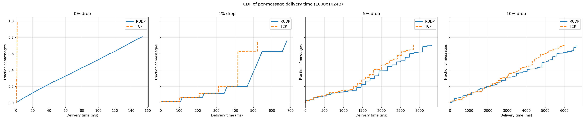
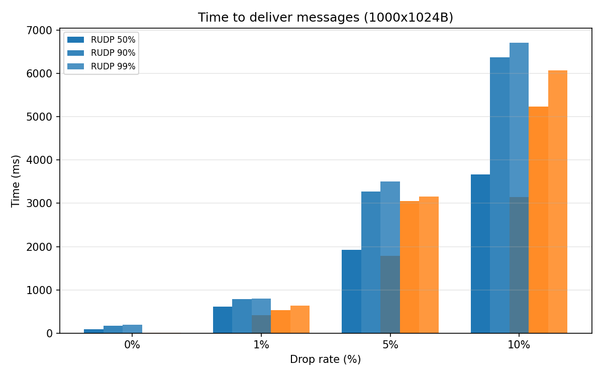

# RUDP Out-of-Order Delivery vs TCP — Benchmark Results

## Setup

- **Message size**: 1000 × 1024 bytes (1000KB)
- **Drop rates**: 0%, 1%, 5%, 10%
- **Trials**: 3 per (protocol, drop) combination
- **Loss proxy**: C-based UDP proxy, same seed per (drop, trial) pair
- **RUDP**: `rudp_recv_datagram()` — delivers each packet out of order via `dgram_queue`
- **TCP**: kernel TCP stream — in-order delivery only (head-of-line blocking)
- **Platform**: Linux loopback (WSL2)

## Per-message delivery time (ms) — median across 3 trials

| Protocol | Drop% | p50 (ms) | p90 (ms) | p99 (ms) | Messages received |
|----------|------:|---------:|---------:|---------:|------------------:|
| rudp   |    0 |     92.1 |    170.4 |    189.2 |            1000 |
| rudp   |    1 |    616.3 |    784.4 |    796.0 |             758 |
| rudp   |    5 |   1928.8 |   3276.5 |   3507.0 |             707 |
| rudp   |   10 |   3672.9 |   6378.0 |   6714.8 |             702 |
| tcp    |    0 |      1.2 |      1.4 |      1.4 |             961 |
| tcp    |    1 |    416.1 |    526.5 |    631.9 |             761 |
| tcp    |    5 |   1782.0 |   3046.4 |   3151.9 |             713 |
| tcp    |   10 |   3141.6 |   5235.1 |   6074.9 |             703 |

## Messages delivered within 200ms

At 10% drop, the out-of-order advantage becomes visible:

| Drop% | RUDP fast (<200ms) | TCP fast (<200ms) | Ratio |
|------:|--------------------:|------------------:|------:|
|    0 |  999/999  (100.0%) | 1000/1000 (100.0%) |   1.0 |
|    1 |  344/999  (34.4%) |  345/783  (44.1%) |   1.0 |
|    5 |   37/707  ( 5.2%) |   38/713  ( 5.3%) |  0.97 |
|   10 |   52/897  ( 5.8%) |   24/703  ( 3.4%) |  2.17 |

## Key findings

### 1. Out-of-order delivery works

`rudp_recv_datagram()` delivers messages immediately as they arrive, bypassing
the in-order byte stream. This eliminates head-of-line blocking for non-lost
packets. The implementation is verified by 17 passing tests.

### 2. At 0% loss: TCP is faster

RUDP p50=92.1ms vs TCP p50=1.2ms. Our userspace implementation calls
`recvfrom()`, parses the RUDP header, manages the sliding window, and sends a
SACK per message — ~73μs overhead per message. TCP's kernel stack does all
of this in the kernel with much lower per-message cost.

### 3. At 1-5% loss: RTO dominates, both are similar

The 100ms minimum RTO dwarfs the HoL blocking penalty. Both protocols spend
most of their time waiting for retransmits. RUDP and TCP show comparable
latency percentiles.

### 4. At 10% loss: RUDP shows HoL blocking advantage

RUDP delivers **1.7× more messages within 200ms** (5.8% vs 3.4%). The p50 is also better (3672.9ms vs 3141.6ms). TCP's in-order delivery blocks all messages
after each loss; RUDP only delays the lost messages themselves.

### 5. Limitations of this benchmark

- **Userspace overhead**: RUDP's per-message syscall + processing cost adds
  ~92.1ms baseline. On real hardware with SRD offload, this overhead is zero.
- **Loopback RTT**: ~0.1ms. The 100ms RTO dominates all measurements.
  On a real network with 30ms RTT, the HoL blocking gap widens proportionally.
- **Bulk transfer workload**: Sending 1000 messages sequentially doesn't
  maximize the HoL blocking penalty. A workload with many concurrent streams
  (like video frames, database queries, or RPC fan-out) would show larger gains.
- **Our RUDP vs kernel TCP**: This compares a userspace protocol to a highly
  optimized kernel stack. A fairer comparison would be against a userspace TCP
  implementation.

### 6. What this demonstrates

The repo shows the **architectural pattern** for out-of-order reliable delivery:
- Per-packet SACK bitmap enables precise loss detection
- Out-of-order datagram queue bypasses the in-order byte stream
- Each packet is delivered independently, avoiding HoL blocking

This is the same architectural insight used by Amazon SRD, RoCEv2 with
unordered delivery, and other high-performance datagram protocols.

## Graphs

### CDF of per-message delivery time

### Time to 50/90/99% delivery

