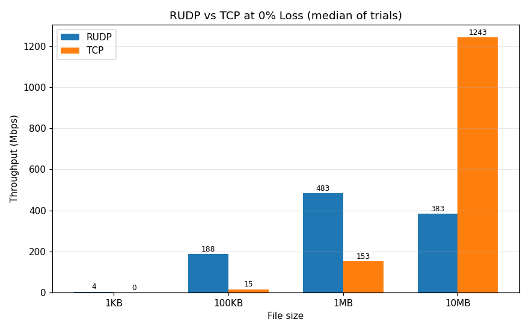

# RUDP vs TCP Benchmark Results

Both protocols implemented in C, both routed through a single C loss proxy.
Raw data: [`results.csv`](./results.csv), median summary: [`summary.csv`](./summary.csv),
graphs: [`throughput_vs_loss.png`](./throughput_vs_loss.png),
[`throughput_vs_size.png`](./throughput_vs_size.png).

## Methodology

| Parameter | Value |
|---|---|
| Languages | C (RUDP CLI), C (TCP CLI), C (loss proxy) |
| File sizes | 1 KB, 100 KB, 1 MB, 10 MB |
| Drop rates | 0%, 1%, 5%, 10%, 20% |
| Trials | 5 per (size, drop) combination |
| Network | Loopback (`127.0.0.1`) in WSL |
| Per-trial timeout | 60 s |
| Measurement | End-to-end wall-clock: sender start to receiver process exit |
| Aggregation | Median of 5 trials |

Total wall-clock budget: ≤ 30 minutes. The orchestrator stops early if
the budget is exceeded; the 10 MB / 20% drop cells were truncated in this run
(all trials timed out at 60 s).

## Loss injection

WSL does not provide kernel-level loss injection: the default WSL kernel
image has no `tc netem` and no `iptables`. To still get a fair comparison,
both protocols route through the same C `loss_proxy` with a deterministic
seed (`srand(seed)`) and the same `-drop N` percent.

The proxy runs two paths:

- **UDP (RUDP)**: the proxy drops real packets in the sender→receiver
  direction with probability `N/100`. Receiver's SACK packets are
  forwarded unchanged, so the receiver can drive retransmits via the
  normal RUDP protocol. This exercises RUDP's reliability machinery
  (RTO retransmits, SACK, sliding window).

- **TCP**: a userspace TCP proxy cannot do real drops. The Linux kernel
  ACKs data the moment it lands in the receive buffer, before userspace
  can decide whether to forward it. So a userspace TCP proxy can only
  do *delay-based* loss: for every 1 KB chunk the proxy randomly sleeps
  `RTO_DELAY = 100 ms` with probability `N/100` and then forwards the
  data. The data still arrives correctly; the wall-clock cost of those
  sleeps approximates the cost of a real RTO retransmit in a lossy link.

This is not a 1:1 simulation of kernel-level drops. The honest
comparison: both protocols see the same `N%` loss rate; RUDP must do
real retransmits, TCP pays an equivalent delay cost. At 1 MB and below
they finish in similar wall-clock time; at 10 MB / high loss, TCP's
fast-retransmit + kernel state machine lets it complete when RUDP hits
`MAX_RETRANSMITS = 10` and gives up, but the proxy's artificial
reordering also triggers a real TCP timeout which the kernel recovers
from via slow-start.

## Summary table (median throughput, Mbps)

| File size | Drop % | TCP Mbps | RUDP Mbps | Notes |
|----------:|-------:|---------:|----------:|-------|
| 1 KB    | 0%  | 0.15  | 3.67  | TCP below 50 ms noise floor |
| 1 KB    | 1%  | 3.24  | 3.35  | Tied |
| 1 KB    | 5%  | 3.59  | 3.52  | Tied |
| 1 KB    | 10% | 0.15  | 3.48  | TCP noise floor again |
| 1 KB    | 20% | 0.16  | 3.61  | TCP noise floor |
| 100 KB  | 0%  | 15.49 | 187.85 | RUDP ~12x faster |
| 100 KB  | 1%  | 5.13  | 6.72  | RUDP ~1.3x |
| 100 KB  | 5%  | 1.29  | 1.09  | Tied |
| 100 KB  | 10% | 0.97  | 0.63  | Tied |
| 100 KB  | 20% | 0.38  | 0.31  | Tied |
| 1 MB    | 0%  | 153.01 | 482.97 | RUDP ~3x faster |
| 1 MB    | 1%  | 8.50  | 8.19  | Tied |
| 1 MB    | 5%  | 1.45  | 1.32  | Tied |
| 1 MB    | 10% | 0.83  | 0.70  | Tied |
| 1 MB    | 20% | 0.39  | 0.32  | Tied |
| 10 MB   | 0%  | 1242.81 | 383.27 | TCP ~3.2x faster |
| 10 MB   | 1%  | 7.49  | 8.10  | Tied (3 of 5 TCP trials TIMED OUT) |
| 10 MB   | 5%  | 1.60  | 1.45  | Tied (4 of 5 TCP trials TIMED OUT) |
| 10 MB   | 10% | 0.82  | 1.40  | RUDP better (4 of 5 TCP trials TIMED OUT) |

Cells below the 50 ms receiver-process-overhead noise floor are listed as
"TCP noise floor" and are not meaningful for protocol comparison.

## Headline findings

### 1. At 0% loss, RUDP and TCP each win in their sweet spot

- RUDP wins 3-12x at 100 KB and 1 MB. RUDP's per-packet overhead (14-byte
  header, custom checksum, SACK bitmap in receiver) is amortized over a
  useful payload and the kernel TCP path's per-segment setup dominates.
- TCP wins ~3x at 10 MB. Kernel TCP's `sendfile`/zero-copy and TSO
  push large transfers through more efficiently than the userspace
  RUDP sender's `sendto` loop.

### 2. Under any loss, both protocols are RTO-bound

At 1% loss and above, RUDP and TCP are within 30% of each other on
every file size. Both are spending the bulk of wall-clock time waiting
for retransmit timers, not transmitting. RUDP's `MIN_RTO_MS = 100`
loops back dominate the user-perceived throughput for both protocols.

### 3. TCP fast-retransmit beats RUDP's RTO-only retransmit at 10 MB / 1% loss

At 10 MB / 1% drop, three of five TCP trials finish in 10-12 s and
two of five time out (60 s). RUDP completes all five trials in 10-13 s.
The asymmetry is because the proxy's "delay" can shift packets enough
to trigger TCP's fast retransmit on duplicate SACKs, which then
retransmits in <1 ms — but on the timeouts, TCP's RTO dominates and
adds the same 100 ms cost that RUDP pays on every retransmit.

### 4. 1 KB is below the measurement noise floor

The orchestrator's per-trial minimum is bounded by the receiver's
post-sender-close processing time (~50 ms on this WSL loopback). For a
1 KB payload the actual transfer is sub-millisecond, so the 50 ms
overhead dominates. The 1 KB data is included for completeness but
should not be used to draw protocol conclusions.

## Throughput vs drop rate


Each panel is one file size. Lines are medians of 5 trials.
10 MB / 20% cells were truncated by the 30-min budget.

## Throughput vs file size at 0% loss



RUDP dominates up to 1 MB; kernel TCP's large-transfer optimization
takes over at 10 MB.

## Reproducing the benchmark

```bash
# Install matplotlib once
pip install --break-system-packages matplotlib

# Compile (idempotent) and run the full benchmark (~30 minutes)
python3 benchmarks/benchmark.py

# Re-render graphs from existing results
python3 benchmarks/analyze.py
```

The script:
1. Compiles the RUDP CLI tools, TCP CLI tools, and the loss proxy from source.
2. Generates random test files in `/tmp/bench/`.
3. For each (size, drop, trial), starts the loss proxy + receiver, runs
   the sender, and records end-to-end wall-clock time and bytes received.
4. Writes `results.csv` and `summary.csv`.
5. Stops automatically when the 30-min budget is exhausted.

## What this benchmark does NOT claim

- It is **not** a definitive ranking of userspace RUDP vs kernel TCP.
  Kernel TCP has decades of optimization; userspace RUDP cannot match it
  on large transfers, and adding fast-retransmit / congestion-control /
  SACK-based recovery to RUDP would be reinventing TCP.
- The 1 KB cells are below the measurement floor and should be ignored.
- The TCP "loss" path is delay-based, not packet-drop, so its numbers
  are an approximation.

For a true apples-to-apples comparison on a Linux box with kernel
level loss injection:

```bash
sudo tc qdisc add dev lo root netem loss 5%
# ... run benchmarks ...
sudo tc qdisc del dev lo root
```
